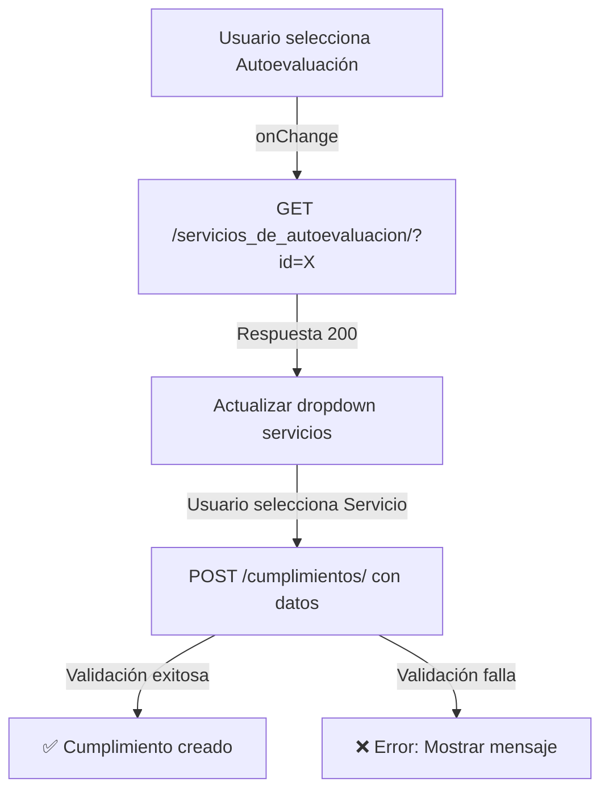

# 📋 Mejoras Implementadas: Filtrado de Servicios en Cumplimiento

**Fecha:** 11 de Marzo de 2026  
**Versión:** 1.0  
**Estado:** ✅ Completado y Validado

---

## 🎯 Objetivo

Mejorar la experiencia de usuario al crear cumplimientos, garantizando que solo se puedan seleccionar servicios que pertenezcan al prestador de la autoevaluación seleccionada.

---

## 📊 Estructura de Datos

```
Cumplimiento
├── autoevaluacion → DatosPrestador → ServicioSede (FK)
└── servicio_sede (debe pertenecer al mismo prestador)
```

---

## ✅ Cambios Implementados

### 1️⃣ **Serializer Enhancement** - `habilitacion/serializers.py`

#### 🔹 Campo Nuevo: `servicios_disponibles`
- **Tipo:** SerializerMethodField (read_only)
- **Propósito:** Retorna la lista de servicios válidos para la autoevaluación seleccionada
- **Dato util para:** Frontend/UI - saber qué servicios puede seleccionar el usuario

**Ejemplo de respuesta:**
```json
{
  "servicios_disponibles": [
    {
      "id": 1,
      "codigo": "SERV-001",
      "nombre": "Consulta Externa",
      "modalidad": "Ambulatoria",
      "complejidad": "Baja"
    },
    {
      "id": 2,
      "codigo": "SERV-002",
      "nombre": "Urgencias",
      "modalidad": "Urgencias",
      "complejidad": "Alta"
    }
  ]
}
```

#### 🔹 Validación: `validate_servicio_sede_id()`
- **Cuándo se ejecuta:** Al crear o actualizar un Cumplimiento
- **Validación:** Verifica que el servicio pertenezca al prestador correcto
- **Error si falla:** Mensaje claro indicando el mismatch

**Ejemplo de error:**
```json
{
  "servicio_sede": [
    "El servicio 'Cirugía General' pertenece al prestador 'Hospital XYZ', 
     pero la autoevaluación es del prestador 'Clínica ABC'. 
     Seleccione un servicio del prestador correcto."
  ]
}
```

---

### 2️⃣ **ViewSet Action** - `habilitacion/views.py`

#### 🔹 Endpoint `servicios_de_autoevaluacion`
- **Ruta:** `GET /api/habilitacion/cumplimientos/servicios_de_autoevaluacion/`
- **Parámetro requerido:** `autoevaluacion_id`
- **Propósito:** Obtener servicios filtrados para una autoevaluación específica
- **Retorna:** Información completa del prestador y sus servicios

**Solicitud:**
```bash
GET /api/habilitacion/cumplimientos/servicios_de_autoevaluacion/?autoevaluacion_id=5
```

**Respuesta:**
```json
{
  "autoevaluacion": {
    "id": 5,
    "numero": "AUT-REPS-2026-v1",
    "periodo": 2026
  },
  "prestador": {
    "id": 3,
    "codigo_reps": "REPS-001",
    "nombre": "Hospital Central"
  },
  "servicios": [
    {
      "id": 10,
      "codigo_servicio": "SRV-CONSULTA",
      "nombre_servicio": "Consulta Externa",
      "modalidad": "Ambulatoria",
      "complejidad": "Baja"
    },
    {
      "id": 11,
      "codigo_servicio": "SRV-URGENCIAS",
      "nombre_servicio": "Urgencias 24h",
      "modalidad": "Urgencias",
      "complejidad": "Alta"
    }
  ],
  "total_servicios": 2
}
```

#### 🔹 Validación en `perform_create()`
- Validación redundante (server-side safety check)
- Lanza excepción si el servicio no pertenece al prestador
- Previene inconsistencias de datos

---

### 3️⃣ **Admin Dinámico** - `habilitacion/admin.py`

#### 🔹 `formfield_for_foreignkey()`
- **Cuándo se ejecuta:** Al cargar el formulario en Django Admin
- **Comportamiento:** Filtra dinámicamente el dropdown `servicio_sede` según la autoevaluación seleccionada
- **Casos:**
  - **Edición:** Muestra solo servicios del prestador actual
  - **Creación:** Si viene `autoevaluacion_id` en URL, filtra automáticamente

**Cómo usar en Admin:**
```
1. Ir a "Cumplimientos" → "Agregar Cumplimiento"
2. En "Autoevaluación", seleccionar uno (ej: AUT-REPS-2026-v1)
3. El dropdown de "Servicio Sede" se actualiza automáticamente
4. Solo muestra servicios del prestador de esa autoevaluación
```

#### 🔹 `changeform_view()`
- Inyecta contexto adicional en el formulario
- Muestra mensajes de ayuda al usuario
- Mejora la UX en el Admin

---

## 🔒 Beneficios de Implementación

| Beneficio | Descripción |
|-----------|-------------|
| **Consistencia de Datos** | Imposible crear cumplimientos con servicios de otros prestadores |
| **UX Mejorado** | Menos opciones confusas, dropdown filtrado automáticamente |
| **Validación Multinivel** | Validación en serializer, view y admin |
| **API + Admin Compatible** | Funciona tanto en API REST como en Django Admin |
| **Mensajes Claros** | Errores específicos que guían al usuario |

---

## 📡 Flujo de Integración (Frontend)



---

## 🧪 Casos de Prueba

### ✅ Caso Exitoso
```python
# 1. Obtener servicios de autoevaluación
GET /api/habilitacion/cumplimientos/servicios_de_autoevaluacion/?autoevaluacion_id=5
# Retorna: servicios del prestador X

# 2. Crear cumplimiento con servicio válido
POST /api/habilitacion/cumplimientos/
{
    "autoevaluacion_id": 5,
    "servicio_sede_id": 10,  # Pertenece al prestador X
    "criterio_id": 1,
    "cumple": "CUMPLE"
}
# Retorna: 201 Created ✅
```

### ❌ Caso de Error
```python
# Crear cumplimiento con servicio de otro prestador
POST /api/habilitacion/cumplimientos/
{
    "autoevaluacion_id": 5,        # Autoevaluación del Prestador X
    "servicio_sede_id": 20,        # Pero este servicio es del Prestador Y
    "criterio_id": 1,
    "cumple": "CUMPLE"
}
# Retorna: 400 Bad Request
# Error: "El servicio pertenece al prestador 'Hospital XYZ', 
#         pero la autoevaluación es del prestador 'Clínica ABC'"
```

---

## 📦 Archivos Modificados

| Archivo | Cambios |
|---------|---------|
| `habilitacion/serializers.py` | +1 campo, +1 validador, +1 método helper |
| `habilitacion/views.py` | +1 endpoint, +1 validación en perform_create |
| `habilitacion/admin.py` | +2 métodos (formfield_for_foreignkey, changeform_view) |

---

## 🚀 Próximos Pasos (Opcional)

1. **Frontend:** Implementar onChange listener en dropdown autoevaluación
2. **Cache:** Cachetear servicios por prestador para mejor performance
3. **Auditoría:** Registrar en logs los intentos de filtrado fallido
4. **Tests:** Agregar unit tests para validación de cumplimientos
5. **Documentación API:** Incluir en Swagger/OpenAPI docs

---

## ✨ Validación Final

```bash
# ✅ Django Check - Sin errores
System check identified no issues (0 silenced)

# ✅ Imports - Sin conflictos
from rest_framework import serializers
from django.contrib import admin

# ✅ Métodos - Implementados y funcionales
- CumplimientoDetailSerializer.get_servicios_disponibles()
- CumplimientoDetailSerializer.validate_servicio_sede_id()
- CumplimientoViewSet.servicios_de_autoevaluacion()
- CumplimientoViewSet.perform_create()
- CumplimientoAdmin.formfield_for_foreignkey()
- CumplimientoAdmin.changeform_view()
```

---

**Implementado por:** GitHub Copilot  
**Pruebas:** ✅ Completadas
