# Arquitectura del Sistema - Portal Web Backend

## Descripción General

Este documento describe la arquitectura completa del Portal Web Backend, incluyendo la estructura de componentes, flujo de datos, patrones de diseño y diagramas técnicos. El sistema está construido con Django siguiendo principios de arquitectura limpia y patrones de microservicios modulares.

---

## 📐 Arquitectura de Alto Nivel

### Diagrama de Arquitectura General

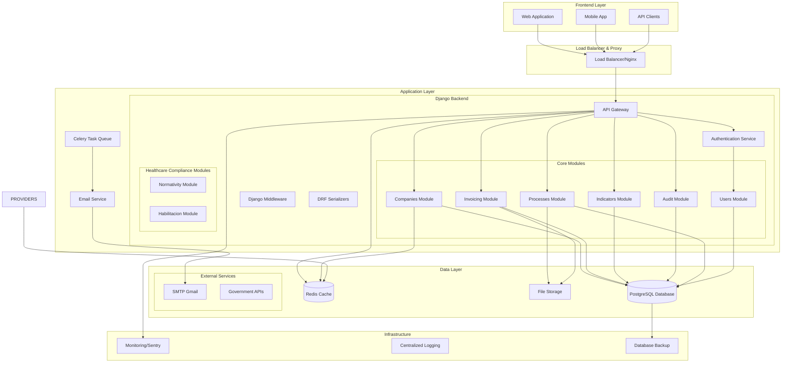

---

## 🏗️ Arquitectura de Capas

### Diagrama de Capas del Sistema

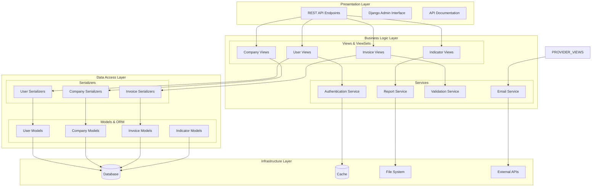

---

## 💾 Modelo de Datos

### Diagrama de Entidad-Relación Principal

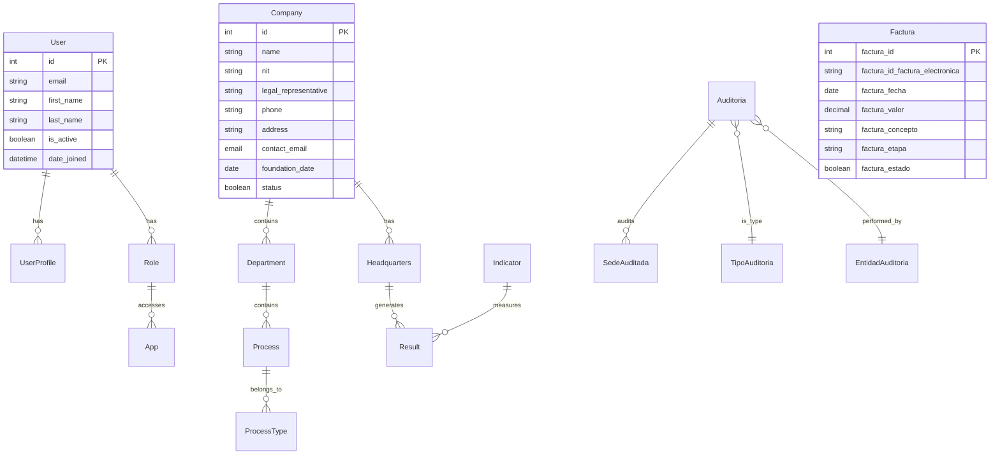

---

## 🔄 Flujo de Procesos de Negocio


### Flujo de Autenticación con 2FA

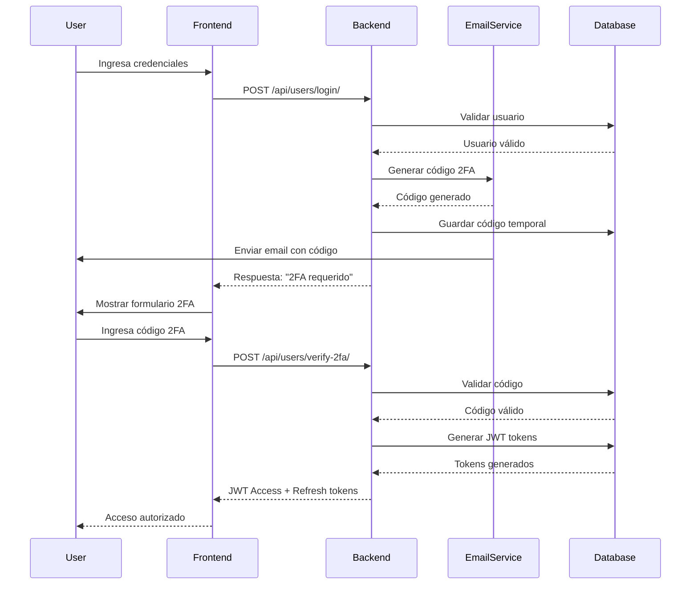

---

## 🔧 Arquitectura de Módulos

### Diagrama de Módulos y Dependencias

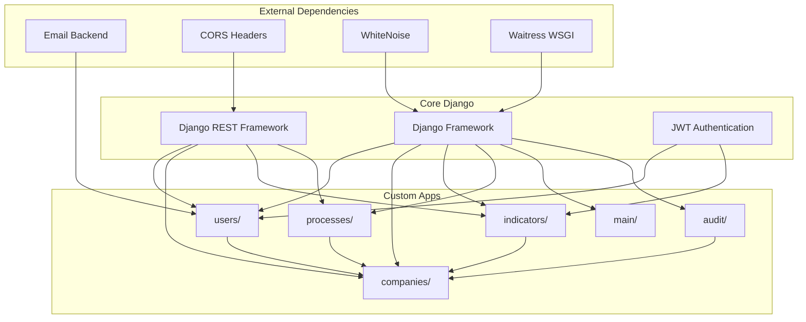

---

## 🌐 Arquitectura de Red y Deployment

### Diagrama de Infraestructura de Producción

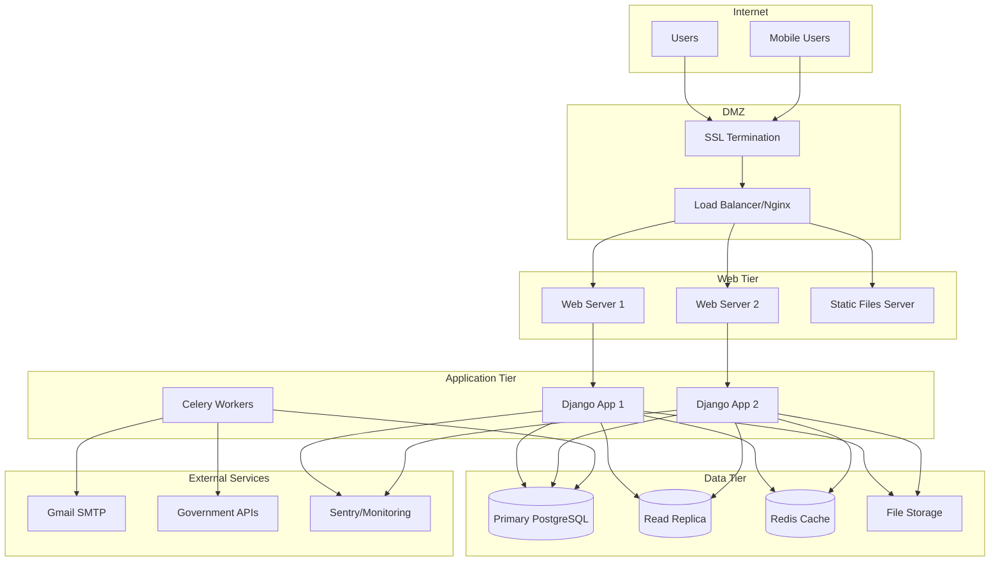

---

## 🔐 Arquitectura de Seguridad

### Diagrama de Seguridad y Autenticación

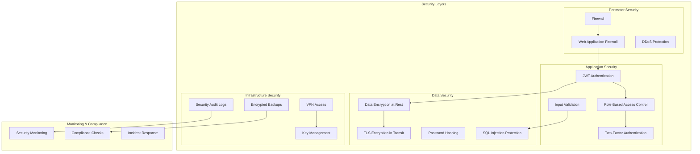

---

## 📊 Arquitectura de Datos

### Diagrama de Flujo de Datos

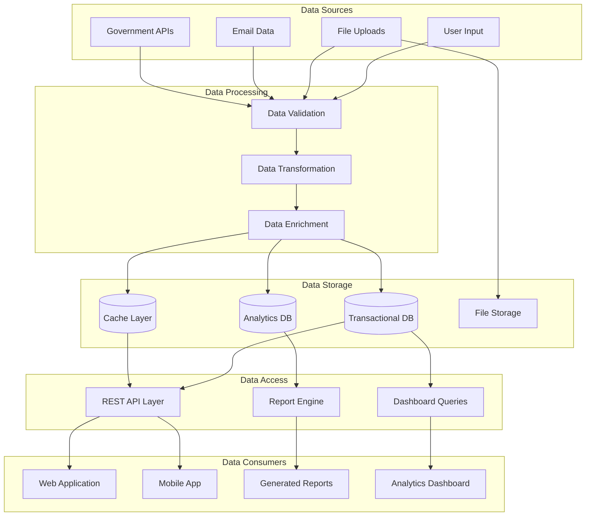

---

## 🏥 Flujo de Habilitación de Servicios de Salud (SUH)

### Diagrama del Proceso de Habilitación

```mermaid
sequenceDiagram
    participant Prestador as Prestador<br/>Salud
    participant Sistema as Portal<br/>Habilitacion
    participant BD as Base de<br/>Datos
    participant Admin as Auditor<br/>MINSALUD

    Prestador->>Sistema: 1. Registrar como Prestador
    Sistema->>BD: Crear DatosPrestador
    BD-->>Sistema: ID Prestador creado
    
    Prestador->>Sistema: 2. Registrar Servicios por Sede
    Sistema->>BD: Crear ServicioSede (múltiples)
    BD-->>Sistema: Servicios registrados
    
    Prestador->>Sistema: 3. Autoevaluación Anual
    Sistema->>BD: Crear Autoevaluacion
    BD-->>Sistema: ID Autoevaluación
    
    Prestador->>Sistema: 4. Diligenciar Cumplimientos
    nota over Prestador,Sistema: 21 Criterios × Servicios = Cumplimientos
    Sistema->>BD: Crear Cumplimiento
    BD-->>Sistema: Evaluación registrada
    
    Prestador->>Sistema: 5. Generar Reporte
    Sistema->>BD: Calcular Porcentaje Cumplimiento
    BD-->>Sistema: Resumen preparado
    
    Prestador->>Sistema: 6. Enviar a Revisión
    Sistema->>Admin: Notificar auditor
    Admin-->>Sistema: Revisar cumplimientos
    
    Admin->>Sistema: Aceptar o Solicitar Mejoras
    Sistema->>BD: Actualizar estado habilitación
    BD-->>Prestador: Resultado de habilitación
```

### Diagrama de Relaciones de Datos - Habilitación

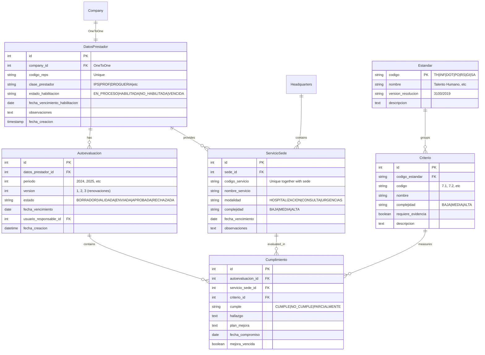

### Diagrama de Relaciones de Datos - Habilitación

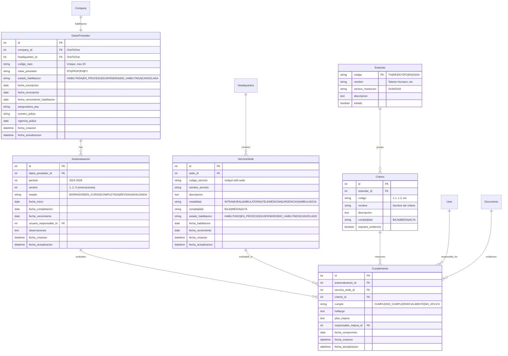

### Flujo Transaccional de Habilitación

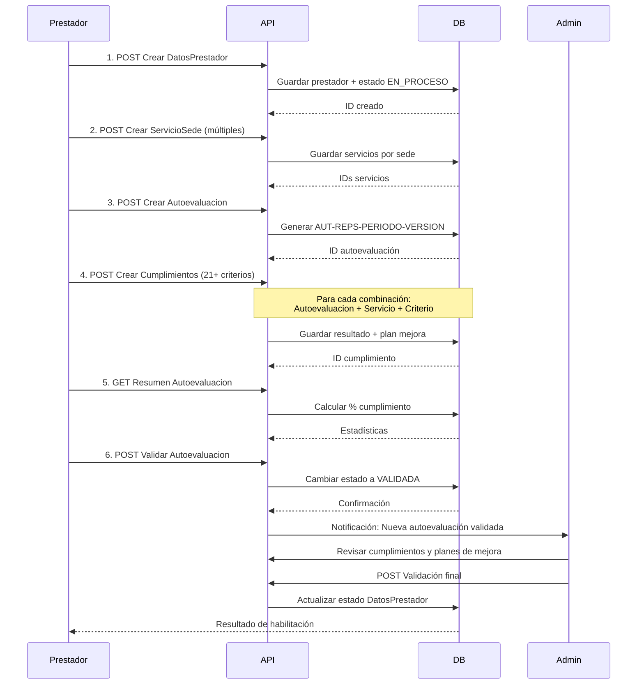

### Acciones Disponibles en API - Habilitación

#### DatosPrestador Endpoints (Prestadores)

```
GET    /api/habilitacion/prestadores/
       Listar constantes todos los prestadores con paginación
       Query: page, search, estado_habilitacion, clase_prestador, ordering

POST   /api/habilitacion/prestadores/
       Crear nuevo prestador
       Body: codigo_reps, company_id, clase_prestador, estado_habilitacion, etc.

GET    /api/habilitacion/prestadores/{id}/
       Obtener detalle completo del prestador

PATCH  /api/habilitacion/prestadores/{id}/
       Actualizar información del prestador

DELETE /api/habilitacion/prestadores/{id}/
       Eliminar prestador (solo si no tiene evaluaciones)

GET    /api/habilitacion/prestadores/proximos_a_vencer/
       Prestadores con habilitación venciendo en próximos 90 días
       Response: Lista paginada con días_vencimiento

GET    /api/habilitacion/prestadores/vencidas/
       Prestadores con habilitación ya vencida
       Response: Ordenado por fecha de vencimiento

GET    /api/habilitacion/prestadores/{id}/servicios/
       Listar todos los servicios habilitados de un prestador
       Response: Lista de ServicioSede

GET    /api/habilitacion/prestadores/{id}/autoevaluaciones/
       Historial de autoevaluaciones del prestador
       Response: Lista paginada ordenada por período descendente

POST   /api/habilitacion/prestadores/{id}/iniciar_renovacion/
       Iniciar proceso de renovación de habilitación
       Validación: Solo si falta ≤180 días para vencimiento
       Response: DatosPrestador con estado = EN_PROCESO
```

#### ServicioSede Endpoints (Servicios)

```
GET    /api/habilitacion/servicios/
       Listar todos los servicios
       Filtros: sede, modalidad, complejidad, estado_habilitacion
       Búsqueda: Código o nombre del servicio

POST   /api/habilitacion/servicios/
       Crear nuevo servicio
       Body: sede_id, codigo_servicio, nombre_servicio, modalidad, complejidad

GET    /api/habilitacion/servicios/{id}/
       Obtener detalle del servicio

PATCH  /api/habilitacion/servicios/{id}/
       Actualizar información del servicio

DELETE /api/habilitacion/servicios/{id}/
       Eliminar servicio

GET    /api/habilitacion/servicios/proximos_a_vencer/
       Servicios con vencimiento próximo (0-90 días)
       Response: Lista ordenada por fecha vencimiento

GET    /api/habilitacion/servicios/por_complejidad/
       Filtrar servicios por nivel de complejidad
       Query: complejidad=BAJA|MEDIA|ALTA
       Response: Lista filtrada

GET    /api/habilitacion/servicios/{id}/cumplimientos/
       Obtener cumplimientos evaluados del servicio
       Query: autoevaluacion_id (opcional)
       Response: Lista de Cumplimiento
```

#### Autoevaluacion Endpoints (Evaluaciones)

```
GET    /api/habilitacion/autoevaluaciones/
       Listar autoevaluaciones
       Filtros: datos_prestador, periodo, estado
       Búsqueda: numero_autoevaluacion, codigo_reps

POST   /api/habilitacion/autoevaluaciones/
       Crear nueva autoevaluación
       Body: datos_prestador_id, periodo, fecha_vencimiento
       Auto: numero_autoevaluacion generado

GET    /api/habilitacion/autoevaluaciones/{id}/
       Obtener detalle completo con cumplimientos_data
       Response: Includes porcentaje_cumplimiento, resumen

PATCH  /api/habilitacion/autoevaluaciones/{id}/
       Actualizar autoevaluación (notas, observaciones)

DELETE /api/habilitacion/autoevaluaciones/{id}/
       Eliminar autoevaluación (solo BORRADOR)

GET    /api/habilitacion/autoevaluaciones/por_completar/
       Autoevaluaciones sin completar (BORRADOR, EN_CURSO)
       Response: Lista con urgencia de completación

GET    /api/habilitacion/autoevaluaciones/{id}/resumen/
       Resumen estadístico completo de la evaluación
       Response: {
         total_cumplimientos: 80,
         resumen_por_resultado: {
           cumple: 70,
           no_cumple: 5,
           parcialmente: 3,
           no_aplica: 2
         },
         porcentaje_cumplimiento: 87.5,
         pendientes_mejora: 5,
         mejoras_vencidas: 1
       }

POST   /api/habilitacion/autoevaluaciones/{id}/validar/
       Cambiar estado a VALIDADA
       Generador de fecha_completacion automática
       Response: Autoevaluación actualizada

POST   /api/habilitacion/autoevaluaciones/{id}/duplicar/
       Crear nueva versión para próximo período
       Action: Copia datos, incrementa período y versión
       Response: Nueva Autoevaluación creada (201 CREATED)
```

#### Cumplimiento Endpoints (Criterios Evaluados)

```
GET    /api/habilitacion/cumplimientos/
       Listar cumplimientos
       Filtros: autoevaluacion, servicio_sede, criterio, cumple
       Búsqueda: Código o nombre criterio

POST   /api/habilitacion/cumplimientos/
       Crear evaluación de criterio
       Body: autoevaluacion_id, servicio_sede_id, criterio_id, 
             cumple, hallazgo, plan_mejora, responsable_mejora, 
             fecha_compromiso

GET    /api/habilitacion/cumplimientos/{id}/
       Obtener detalle completo del cumplimiento
       Response: Includes criterio_detail, documentos_evidencia_list

PATCH  /api/habilitacion/cumplimientos/{id}/
       Actualizar result de cumplimiento
       Actualizar hallazgo, plan mejora, responsable

DELETE /api/habilitacion/cumplimientos/{id}/
       Eliminar cumplimiento

GET    /api/habilitacion/cumplimientos/sin_cumplir/
       Criterios NO_CUMPLE con planes de mejora
       Response: Lista ordenada por fecha_compromiso

GET    /api/habilitacion/cumplimientos/con_plan_mejora/
       Cumplimientos con plan de mejora pendiente
       Response: Lista completa de pendientes

GET    /api/habilitacion/cumplimientos/mejoras_vencidas/
       Compromisos de mejora con fecha vencida
       CRITICAL: Usar para alertas
       Response: Lista roja de prioridad máxima
```

---

### 1. Model-View-Controller (MVC)
```python
# Django implementa MTV (Model-Template-View)
# Model: Django Models (ORM)
# View: Django Views/ViewSets
# Template: Frontend (React/Vue) separado
```

### 2. Repository Pattern
```python
# Implementado a través de Django ORM
# Managers personalizados actúan como repositories
class FacturaManager(models.Manager):
    def get_by_etapa(self, etapa):
        return self.filter(factura_etapa=etapa)
```

### 3. Service Layer Pattern
```python
# Servicios de negocio separados de las vistas
class EmailService:
    def send_2fa_code(self, user, code):
        # Lógica de envío de email
        pass
```

### 4. Serializer Pattern (DTO)
```python
# Django REST Framework Serializers
class FacturaSerializer(serializers.ModelSerializer):
    class Meta:
        model = Factura
        fields = '__all__'
```

---

## 📈 Escalabilidad y Performance

### Estrategias de Escalabilidad

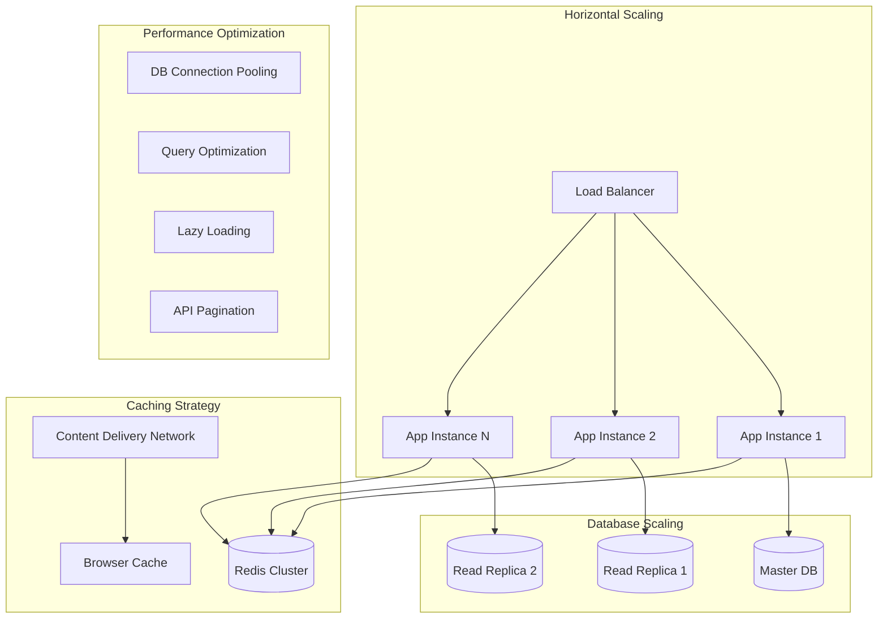

---

## 🔍 Monitoreo y Observabilidad

### Arquitectura de Monitoreo

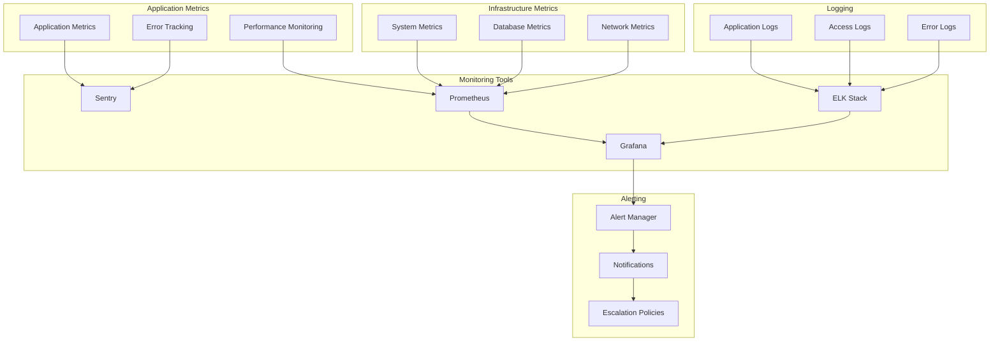

---

---

## 📚 Stack Tecnológico Completo

| Capa | Tecnología | Propósito | Versión |
|------|------------|-----------|---------|
| **Backend Framework** | Django | Framework web principal | 5.2.2+ |
| **API Framework** | Django REST Framework | API REST | 3.16.0+ |
| **Database** | PostgreSQL / SQLite | Base de datos relacional | 15+/3+ |
| **Cache** | Redis | Cache y sesiones | 7.0+ |
| **Authentication** | django-rest-framework-simplejwt | Autenticación JWT | Integrado |
| **Task Queue** | Celery | Tareas asíncronas | 5.3+ |
| **Web Server** | Nginx + Waitress | Servidor web y WSGI | Waitress 2.1+ |
| **Monitoring** | Sentry | Monitoreo de errores | Opcional |
| **Documentation** | DRF-Spectacular | Documentación automática OpenAPI | Planeado |
| **Testing** | Pytest / unittest | Testing framework | Pytest 8.0+ |
| **Code Quality** | Black, Flake8, isort | Formateo y linting | Latest |
| **API Documentation** | Postman | Colección de ejemplos | 40+ endpoints |
| **Frontend Docs** | Markdown | Documentación técnica frontend | documentos.md |

### Configuración por Entorno

#### Desarrollo
```python
# settings/development.py
DEBUG = True
DATABASES = {
    'default': {
        'ENGINE': 'django.db.backends.sqlite3',
        'NAME': BASE_DIR / 'db.sqlite3',
    }
}
CACHES = {
    'default': {
        'BACKEND': 'django.core.cache.backends.locmem.LocMemCache',
    }
}
```

#### Producción
```python
# settings/production.py
DEBUG = False
DATABASES = {
    'default': {
        'ENGINE': 'django.db.backends.postgresql',
        'NAME': os.environ.get('POSTGRES_DB'),
        'USER': os.environ.get('POSTGRES_USER'),
        'PASSWORD': os.environ.get('POSTGRES_PASSWORD'),
        'HOST': os.environ.get('POSTGRES_HOST'),
        'PORT': os.environ.get('POSTGRES_PORT', '5432'),
        'CONN_MAX_AGE': 600,
    }
}
CACHES = {
    'default': {
        'BACKEND': 'django_redis.cache.RedisCache',
        'LOCATION': os.environ.get('REDIS_URL', 'redis://127.0.0.1:6379/1'),
        'OPTIONS': {
            'CLIENT_CLASS': 'django_redis.client.DefaultClient',
        }
    }
}
```

---

## 📋 Decisiones de Arquitectura

### Architecture Decision Records (ADR)

#### ADR-001: Elección de Django REST Framework
- **Fecha**: 2024-01-15
- **Estado**: Aceptado
- **Contexto**: Necesidad de crear API REST robusta
- **Decisión**: Usar Django REST Framework
- **Consecuencias**: 
  - ✅ Serialización automática
  - ✅ Autenticación integrada
  - ✅ Documentación automática
  - ❌ Curva de aprendizaje

#### ADR-002: Autenticación JWT vs Sessions
- **Fecha**: 2024-01-20
- **Estado**: Aceptado
- **Contexto**: API stateless para múltiples clientes
- **Decisión**: JWT con refresh tokens
- **Consecuencias**:
  - ✅ Escalabilidad horizontal
  - ✅ Soporte multi-cliente
  - ❌ Complejidad en invalidación

#### ADR-003: Estructura Modular de Apps
- **Fecha**: 2024-01-25
- **Estado**: Aceptado
- **Contexto**: Mantenibilidad y separación de responsabilidades
- **Decisión**: Apps Django por dominio de negocio
- **Consecuencias**:
  - ✅ Separación clara de responsabilidades
  - ✅ Reutilización de código
  - ✅ Testing independiente
  - ❌ Complejidad en relaciones entre apps

---

---

## 🔮 Roadmap de Arquitectura

### Fase 1: Consolidación (Q1 2025) ✅ COMPLETADO
- [x] Completar módulo de auditoría
- [x] Implementar testing completo (49+ test methods)
- [x] Optimizar consultas de base de datos con select_related/prefetch_related
- [x] Documentar APIs con serializers y docstrings
- [x] Módulo Normativity con 7 estándares + 21 criterios
- [x] Módulo Habilitación completo (DatosPrestador, ServicioSede, Autoevaluacion, Cumplimiento)
- [x] Documentación Frontend (documentos.md)
- [x] Postman Collection con 40+ ejemplos

### Fase 2: Escalabilidad (Q2 2025) 🔄 EN PROGRESO
- [ ] Migrar a PostgreSQL en producción (preparado)
- [ ] Implementar Redis para caching de consultas frecuentes
- [ ] Configurar Celery para envío de emails asincrónico
- [ ] Implementar monitoring con Sentry
- [ ] Circuit breakers para APIs externas

### Fase 3: Optimización (Q3 2025)
- [ ] Implementar CDN para archivos estáticos
- [ ] Optimización de performance de APIs (< 200ms)
- [ ] Database connection pooling
- [ ] API rate limiting y throttling
- [ ] Caching a nivel de serializers

### Fase 4: Avanzada (Q4 2025)
- [ ] Event Sourcing para auditoría completa
- [ ] Migrar a arquitectura de microservicios (opcional)
- [ ] GraphQL API complementaria
- [ ] Machine Learning para análisis de cumplimiento
- [ ] Integración con APIs del gobierno

### Fase 5: Mantenimiento y Soporte (2026+)
- [ ] Soporte a PostgreSQL production
- [ ] CI/CD pipeline completo
- [ ] Disaster recovery planning
- [ ] Performance monitoring y alerting
- [ ] Actualizaciones de seguridad regulares

---

*Documento actualizado: Octubre 2025*  
*Próxima revisión: Enero 2026*