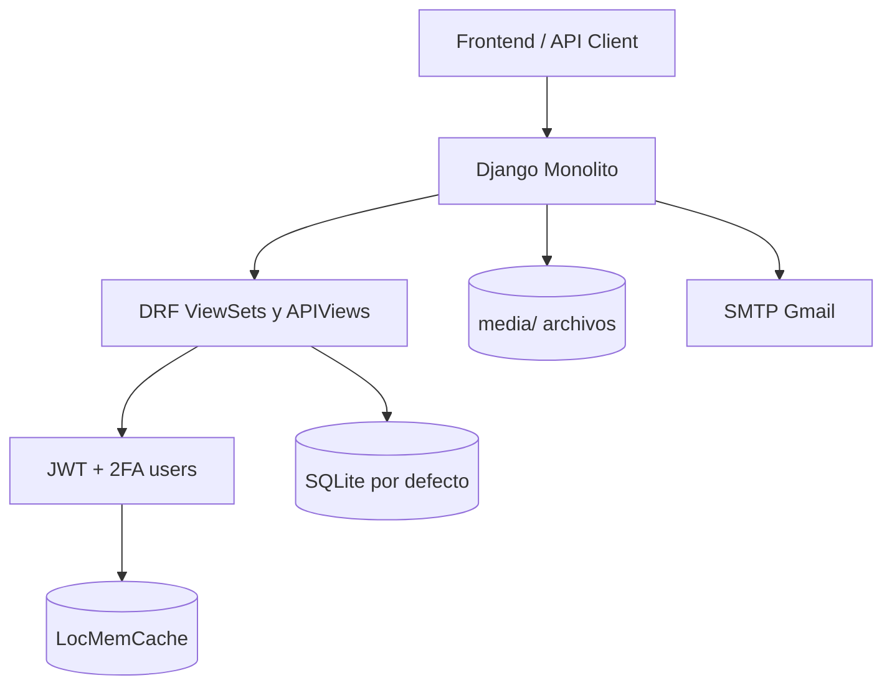
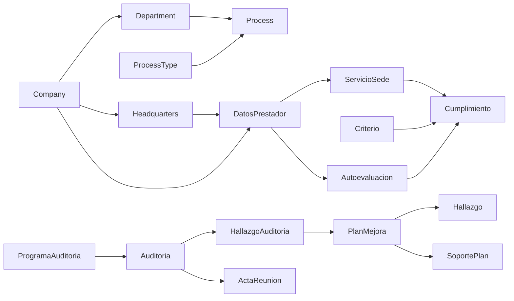

# Arquitectura del Sistema - Portal Web Backend

## Objetivo

Este documento describe la arquitectura real implementada en el repositorio, con foco en lo que existe y funciona actualmente.
No documenta componentes hipotéticos o planeados como si ya estuvieran operativos.

## Estado Arquitectónico Actual

- Tipo de sistema: monolito Django (no microservicios)
- Exposición API: Django REST Framework con routers y APIViews
- Autenticación principal: JWT (SimpleJWT)
- 2FA: flujo habilitado en app users
- Base de datos activa por defecto: SQLite
- Cache activa por defecto: memoria local (LocMemCache)
- Servido de estáticos: WhiteNoise
- Servidor de ejecución: runserver (desarrollo) y Waitress (script local)

## Vista de Alto Nivel

## Estructura de Aplicaciones

Aplicaciones instaladas en settings:

- users
- companies
- processes
- main
- indicators
- normativity
- habilitacion
- soportes
- mejoras
- audit

## Enrutamiento API Real

Prefijos montados desde backend/urls.py:

- /api/users/
- /api/companies/
- /api/processes/
- /api/main/
- /api/indicators/
- /api/normativity/
- /api/habilitacion/
- /api/soportes/
- /api/mejoras/
- /api/audit/

Endpoints globales:

- POST /api/token/
- POST /api/token/refresh/

Inventario detallado y canónico:

- ENDPOINTS_API.md

## Módulos y Responsabilidades

### users

- Login JWT
- Verificación OTP
- Activación/desactivación 2FA
- Recuperación y cambio de contraseña
- Consulta/edición de usuario actual
- Gestión de roles

### companies

- Empresas
- Departamentos
- Sedes
- Tipos de proceso
- Procesos
- Regiones y municipios

### processes

- Documentos de proceso
- Preview y descarga de archivo

### main

- Funcionarios
- Contenidos
- Eventos
- Felicitaciones
- Reconocimientos

### indicators

- Indicadores
- Resultados
- Endpoint detallado para dashboard (results/detailed)

### normativity

- Estándares
- Criterios
- Documentos normativos
- Endpoints de consulta especializada (mandatorios, por complejidad, etc.)

### habilitacion

- Prestadores
- Servicios por sede
- Autoevaluaciones
- Cumplimientos
- Capacidades
- Medidas de seguridad
- Sanciones
- Novedades REPS
- Requisitos documentales
- Checklists y evidencias

### soportes

- Categorías de soporte
- Tipos de documento
- Documentos de soporte

### mejoras

- Planes de mejora
- Hallazgos
- Soportes adjuntos por plan
- Estadísticas y consultas por origen

### audit

- Auditorías
- Entidades y tipos de auditoría
- Hallazgos de auditoría
- Actas
- Programas
- Transiciones de fase y gestión de equipo auditor

## Relaciones de Dominio (Resumen)

## Seguridad Implementada

- Autenticación DRF vía JWT (DEFAULT_AUTHENTICATION_CLASSES)
- 2FA funcional en flujos de users
- CORS configurado para orígenes locales definidos
- CSRF trusted origins configurado desde FRONTEND_URL
- Custom user model: users.User

## Persistencia y Archivos

- DB activa: SQLite (db.sqlite3)
- Configuración PostgreSQL: existe como alternativa comentada
- MEDIA_ROOT: media/
- STATIC_ROOT: staticfiles/

## Infraestructura y Deployment Real

### Desarrollo

- python manage.py runserver

### Ejecución local tipo producción

- python run_waitress.py

### IIS

- Existe web.config en el repositorio

## Hallazgos de Revisión Estricta

Estos puntos estaban documentados previamente como actuales, pero no corresponden al estado real de implementación observado:

- Arquitectura de microservicios: no aplica; es monolito Django
- Celery operando: no hay configuración activa en settings ni dependencia en requirements
- Redis operando como cache principal: no aplica; cache actual es LocMemCache
- PostgreSQL activo por defecto: no aplica; el backend corre con SQLite por defecto
- Módulo de facturación como app activa: no existe app de facturación en INSTALLED_APPS ni en urls

## Fuente de Verdad Técnica

Para mantenimiento documental, validar contra:

- backend/settings.py
- backend/urls.py
- cada app en */urls.py y */views.py
- requirements.txt
- ENDPOINTS_API.md

---

Documento actualizado con base en revisión técnica del código fuente actual.
